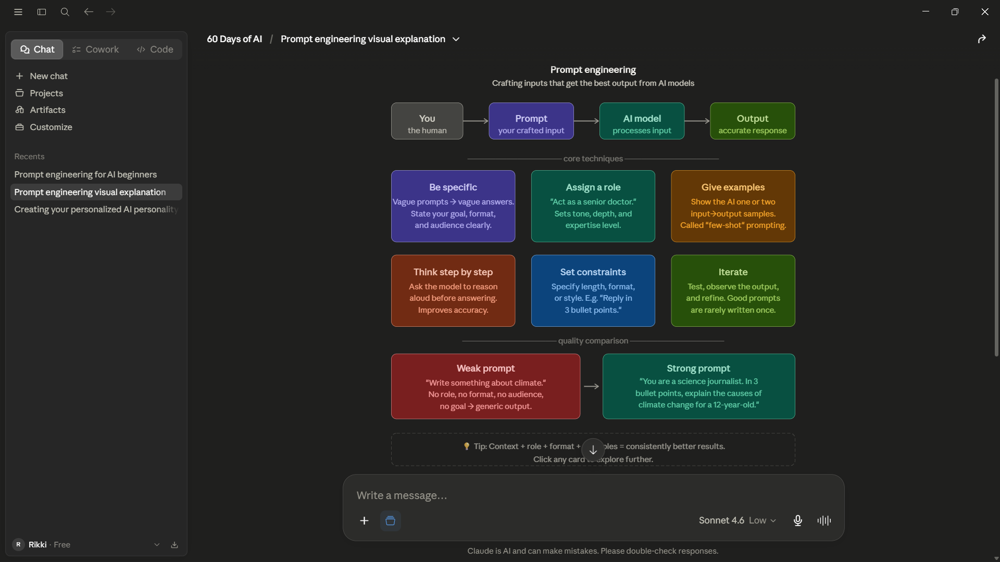
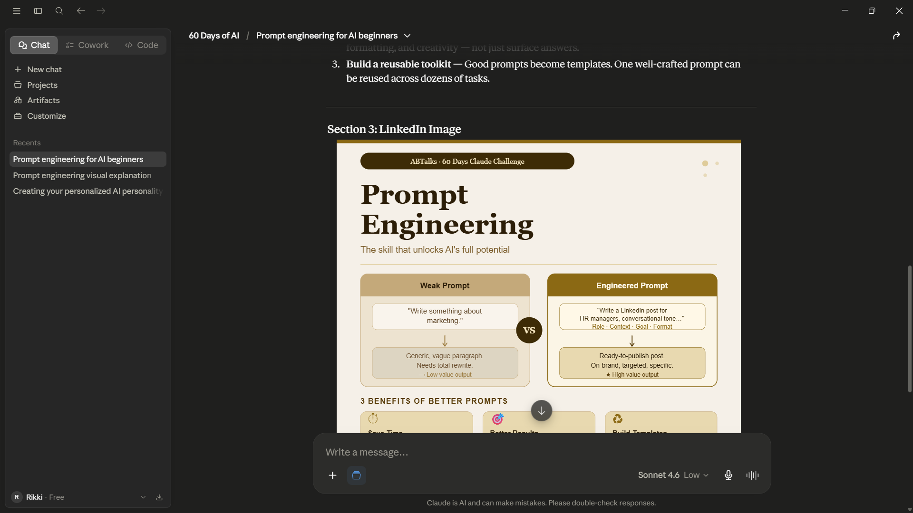

# Day 2 – Prompt Engineering

## What I Learned

Today I learned about Prompt Engineering and experimented with two different types of prompts.

### Prompt 1 – Simple Prompt

Prompt:
"Create an image explaining Prompt Engineering"

The result was a clean visual explanation that helped me quickly understand the concept.

### Output

---

### Prompt 2 – Engineered Prompt

Prompt:

You are an AI educator teaching complete beginners.
Explain Prompt Engineering in simple language.

Include:
- What Prompt Engineering is
- Why it matters when using AI tools like Claude
- One example of a weak prompt
- One example of an improved prompt
- Three practical benefits of writing better prompts

The result was significantly more detailed and tailored.

### Output

---

## My Key Insight

Before this exercise, I assumed that better prompt engineering simply meant getting "better" outputs.
What I discovered is that the best prompt depends on the objective.

A simple prompt can be more effective when:
- You need a quick explanation
- You already have some background knowledge
- You want a fast overview

An engineered prompt becomes more valuable when:
- You need detailed information
- You want structured output
- You have specific requirements
- You are creating professional content

---

## My Conclusion

Prompt Engineering is not about making prompts longer.
It is about providing the right amount of context for the task you want to accomplish.
Simple prompts are useful for exploration and quick learning.
Engineered prompts are useful when precision, personalization, structure, and quality matter.
The real skill is knowing when to use each approach.
