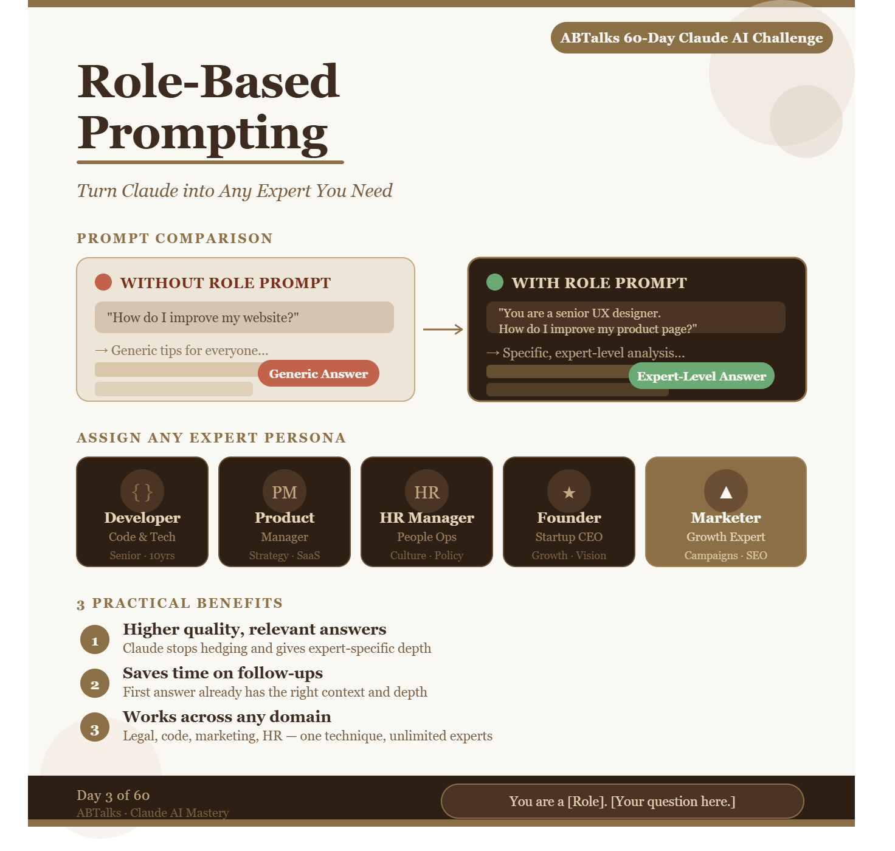
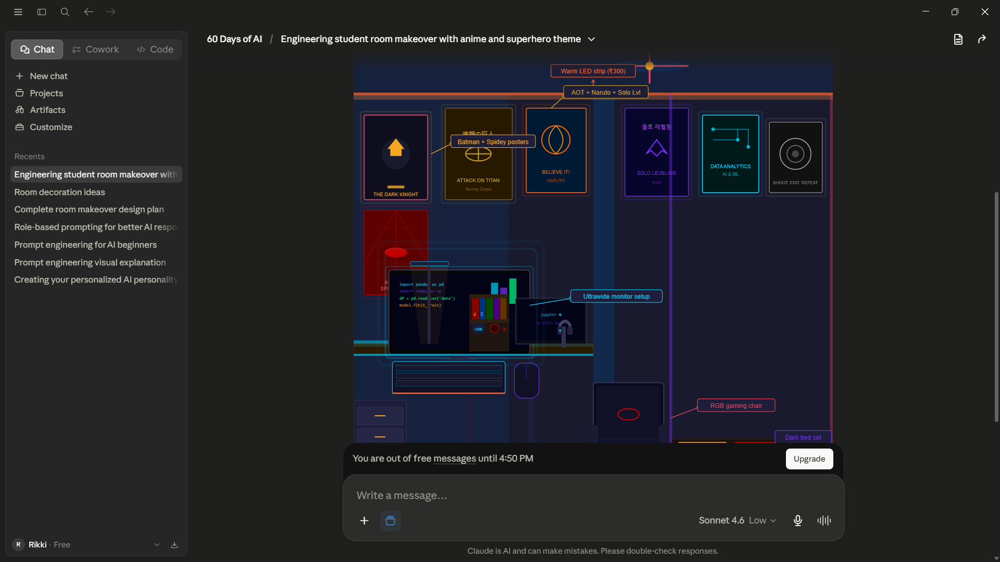

# Day 3 – Role-Based Prompting

## What I Learned

Today I learned about Role-Based Prompting and experimented with it by asking AI to redesign my room.
Role-Based Prompting is a technique where we assign a specific role to the AI before giving it a task.
Instead of asking a general question, we tell the AI who it should act as. This helps the model respond with the knowledge, perspective, and priorities of that role.

---

## My Experiment

I uploaded a photo of my room and used the following prompt:

### Prompt

> Act as a professional interior designer. Analyze my room and suggest a complete makeover including poster placement, color combinations, lighting, desk arrangement, wall decor, and overall aesthetics.

### Output

The AI analyzed the room, suggested design improvements, recommended lighting, color palettes, poster placements, and even generated a visual concept.

The response felt much more structured and professional because the AI was approaching the task from the perspective of an interior designer.

---

## What Was Missing?

Although the suggestions were useful, the generated room design did not look exactly like my room.

Some observations:

* The room layout was only partially preserved.
* The AI generated a stylized interpretation rather than an exact replica.
* Some suggestions felt generic.
* The final concept leaned toward a gaming-room aesthetic rather than my actual interests.

This made me realize that assigning a role alone is not enough.

---

## How I Could Improve The Prompt

After the experiment, I realized I should have provided more context and constraints.

For example:

> Use my uploaded room photo as the exact base layout.
>
> Preserve the room structure, furniture positions, and dimensions.
>
> I am a 21-year-old engineering student interested in Data Analytics, AI, Photography, Spider-Man, Batman, and Anime.
>
> Design the room with themed posters, warm lighting, and a productivity-focused workspace while keeping the room visually recognizable.

Adding context helps the AI understand not only the role but also the specific outcome I want.

---

## My Key Insights

Before this exercise, I thought assigning a role would automatically produce the perfect result.

What I discovered is that role prompting is only one part of the equation.

Good results also require:

* Context
* Personal preferences
* Clear constraints
* Realistic expectations

---

## How Model Choice Affects Results

During this experiment, I used Claude Sonnet 4.6 Low.

The model provided strong reasoning and useful design suggestions, but the visual output was not an exact recreation of my room.

This taught me that prompt quality is important, but model capability matters too.

Different models excel at different tasks. Some are stronger at reasoning and planning, while others are better at image editing and photorealistic visual generation.

---

## My Conclusion

Role-Based Prompting helps AI think like a specialist instead of a general assistant.

However, the best results come from combining the right role, detailed context, clear instructions, and the right AI model.

The role tells AI how to think. Context tells AI what matters.

