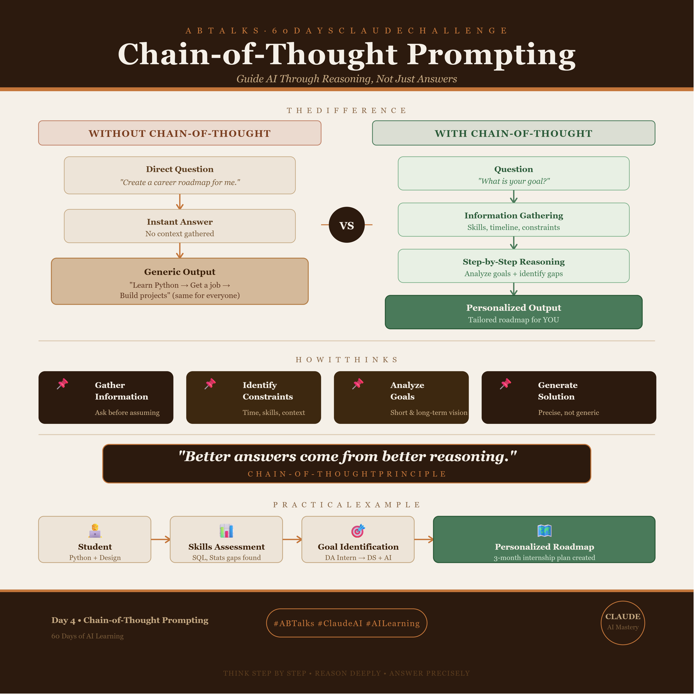
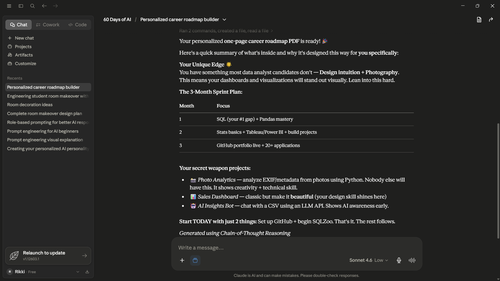

# Day 4 – Chain-of-Thought Prompting

## Objective

Learn how Chain-of-Thought Prompting improves AI responses by collecting information and reasoning before generating an answer.

 
---

## My Experiment

I used Claude's Career Roadmap Builder.

Instead of generating a roadmap immediately, Claude first asked questions about my current situation, skills, goals, and timeline before creating a personalized roadmap.

### Ouestions asked by Claude and My Answers

| Question          | Answer                                   |
| ----------------- | ---------------------------------------- |
| Current Situation | Student                                  |
| Skills            | Python, Design, Photography              |
| Target Goal       | Data Analytics Internship → Data Science |
| Timeline          | 3 Months                                 |

---

## Generated Roadmap

---

## What Changed?

| Direct Prompt Approach          | Chain-of-Thought Approach         |
| ------------------------------- | --------------------------------- |
| Generates an answer immediately | Collects information first        |
| More generic recommendations    | More personalized recommendations |
| Assumes goals and constraints   | Verifies goals and constraints    |
| Less context-aware              | More context-aware                |

---

## Observations

* SQL was identified as one of my biggest skill gaps.
* The roadmap connected my Design and Photography skills with Data-related careers.
* Learning was broken into stages instead of recommending everything at once.
* The suggested projects aligned with my background and interests.

---

## Limitation

The roadmap focused more on a Data Analyst path, while my long-term goal is Data Science with AI as a supporting skill.

This showed that Chain-of-Thought improves reasoning, but the final result still depends on how clearly goals are communicated.

---

## Key Learning

Chain-of-Thought Prompting does not simply generate an answer.

It gathers information, reasons through the problem, and then creates a more personalized response.

The better the information provided during this process, the more relevant the final output becomes.

---

## Conclusion

The biggest difference was not the roadmap itself.

The biggest difference was the process.

By asking questions first, the AI produced a roadmap that was more relevant to my skills, timeline, and career goals than a one-shot prompt would have.
