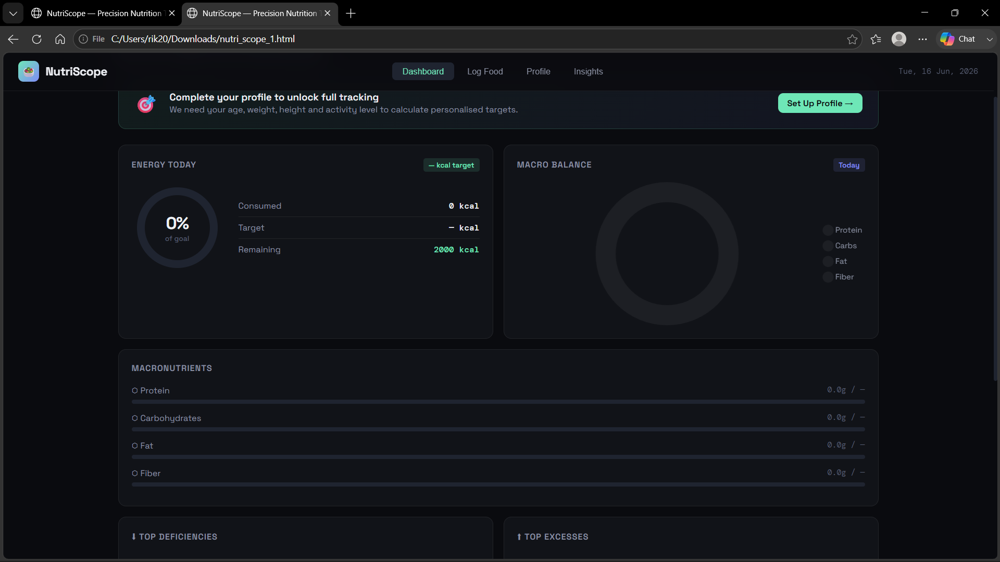
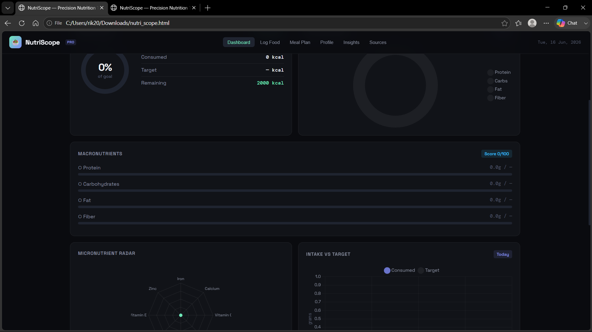

# Day 9 – NutriScope: From MVP to Enhanced Dashboard

## Objective

Learn how iterative prompting can improve an AI-generated application by comparing a basic MVP with an enhanced version of the same product.

---

## Project

NutriScope is an AI-generated nutrition tracking dashboard designed to help users monitor calorie intake, macronutrients, and overall nutritional balance.

For this task, I generated two versions:

- Prompt 1 → MVP Version
- Prompt 2 → Enhanced (Pro) Version

---

## Files Included

- `Promt-1.html` — MVP version generated using Prompt 1
- `Prompt-2.html` — Enhanced version generated using Prompt 2
- `1st-Prompt.png` — Screenshot of MVP dashboard
- `2nd-Prompt.png` — Screenshot of Enhanced dashboard

---

## Screenshots

### MVP Version (Prompt 1)

### Enhanced Version (Prompt 2)

---

## Comparison

| Feature | Prompt 1 (MVP) | Prompt 2 (Enhanced) |
|----------|----------|----------|
| Dashboard Layout | Basic | More polished |
| Navigation | Limited | Improved multi-section navigation |
| Calorie Tracking | ✅ | ✅ |
| Macronutrient Tracking | ✅ | ✅ |
| Meal Planning | ❌ | ✅ |
| Insights Section | ❌ | ✅ |
| Professional UI | Medium | High |
| Product Feel | Prototype | Product-like |
| Overall Experience | Functional | More complete |

---

## My Observations

The MVP version successfully demonstrated the core idea of a nutrition dashboard. It included calorie tracking, macro tracking, and a clean interface, making it a functional prototype.

The enhanced version felt significantly more complete. Additional sections such as meal planning, insights, and improved navigation made the application feel closer to a real-world product rather than just a proof of concept.

The visual improvements were immediately noticeable, but both versions still relied on predefined nutrition logic. The dashboard looked good, but it lacked real-world integrations that would make it genuinely useful for daily use.

---

## What Could Be Improved?

Although the enhanced version was clearly better, I think it could go much further.

Some improvements I would add:

- Integration with real nutrition databases
- Barcode scanning support
- Personalized meal recommendations
- Weekly and monthly nutrition analytics
- Progress tracking over time
- Fitness tracker integration
- Better micronutrient insights
- AI-powered dietary suggestions

This exercise showed me that while AI can build impressive prototypes, the quality of the final product still depends on how detailed the requirements are.

---

## Key Learnings

- AI can generate complete software prototypes from natural language prompts.
- Iterative prompting improves both functionality and user experience.
- Small prompt changes can create significant differences in output quality.
- A visually impressive dashboard is not always a complete product.
- Better prompts produce better results.

---

## Biggest Insight

The biggest takeaway from this exercise was understanding the difference between an MVP and a refined product.

The first version proved the concept. The second version improved the experience.

AI did not fundamentally change the application—it improved it because the prompt provided more context and better requirements. This reinforced an important lesson:

**Better prompts lead to better products.**

---

## Conclusion

This task demonstrated how iterative refinement can transform a simple prototype into a more polished application.

The MVP established the foundation, while the enhanced version showed how additional context and requirements can significantly improve the final result. The exercise highlighted the importance of prompt quality, product thinking, and continuous refinement when working with AI-generated applications.
